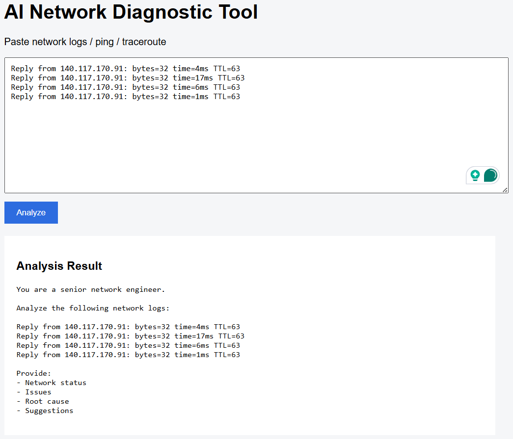

# AI Network Diagnostic Assistant

## Overview
This project is a web-based AI system that analyzes network logs and provides structured troubleshooting suggestions using Hugging Face Transformers.

## Features
- AI-based network log analysis
- Root cause detection
- Structured troubleshooting report
- Simple web UI (Flask)

## Tech Stack
- Python
- Flask
- Hugging Face Transformers
- Prompt Engineering
- HTML/CSS

## System Flow
User Input → Flask → Prompt Engineering → LLM → Structured Output

## Example Input
ping loss 20%
latency spike 300ms
traceroute timeout at hop 5

## Output Example
- Network status: unstable
- Issue: packet loss
- Root cause: congestion
- Suggestion: check routing / ISP

### Example
- 

## How to Run
pip install -r requirements.txt
python app.py
